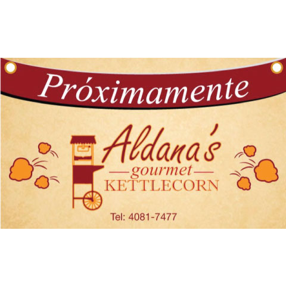
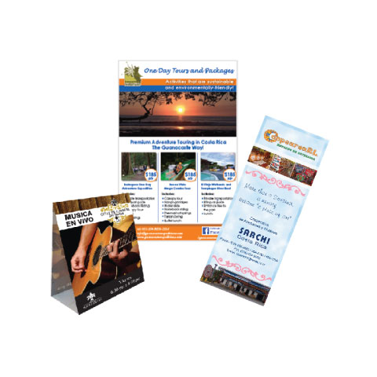
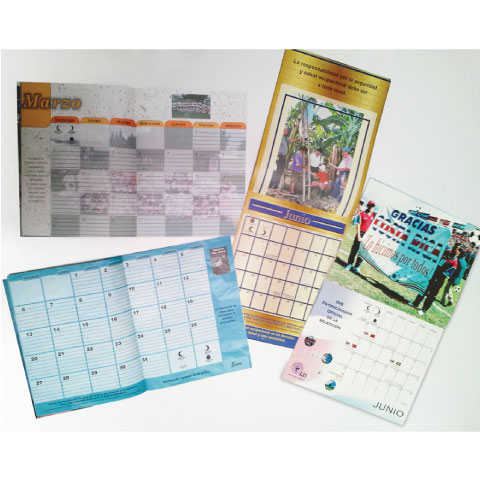

<!DOCTYPE html>
<html lang="es">
<head>
  <meta charset="UTF-8">
  <meta name="viewport" content="width=device-width, initial-scale=1.0">
  <meta http-equiv="X-UA-Compatible" content="ie=edge">
  <title>Tres o 4</title>
<!-- Metadata -->
  <meta name="author" content="Ra&uacute;l C&aacute;rdenas">
  <meta name="copyright" content="Ra&uacute;l C&aacute;rdenas">
  <meta name="Dc.title" content="Tres o 4">
  <meta name="Description" content="El dise&ntilde;o gr&aacute;fico y web para las empresas, es una que herramienta provee la identificaci&oacute;n y comunicaci&oacute;n efectiva que logra hacernos destacar en el mercado de hoy.">
  <meta name="robots" content="index, follow">
<!-- Favicon -->
  <link rel="apple-touch-icon" sizes="180x180" href="img/favicon/apple-touch-icon.png">
  <link rel="icon" type="image/png" sizes="32x32" href="img/favicon/favicon-32x32.png">
  <link rel="icon" type="image/png" sizes="16x16" href="img/favicon/favicon-16x16.png">
  <link rel="manifest" href="img/favicon/site.webmanifest">
  <link rel="mask-icon" href="img/favicon/safari-pinned-tab.svg" color="#5bbad5">
  <meta name="msapplication-TileColor" content="#da532c">
  <meta name="theme-color" content="#ffffff">
<!-- Styles -->
  <link rel="stylesheet" href="https://rauldario.github.io/tresocuatro/css/style.css">
</head>
<body>
  <header>
    

      

      
<h2>Cont&aacute;ctenos</h2>
8839-0807

info@tresocuatro.com

    

      <!-- nav pc -->
      <nav class="nav-pc">
        <ul>
          <li><a href="#topinfo">Inicio</a></li>
          <li><a href="#grafico">Dise&ntilde;o Gr&aacute;fico</a></li>
          <li><a href="#web">Dise&ntilde;o Web</a></li>
          <li><a href="#contacto">Contacto</a></li>
        </ul>
      </nav>
  </header>
  <main>
    <section class="welcome">
      <h1>Bienvenidos</h1>
      
Actualmente la presencia de las empresas se logra con una comunicación efectiva para competir en el cambiante mundo de los negocios.

      
Como profesionales en el campo del Diseño Gráfico y del Diseño Web, creemos fielmente que el trabajo en equipo asegura el éxito, por lo que desde el momento en que empezamos a trabajar con usted y su empresa nos convertimos en parte de su equipo.

      
Somos dos profesionales con 18 años de experiencia en producción gráfica y programación. Cada uno especializado en diferentes ámbitos para brindarle las mejores opciones en sus proyectos.

    </section>
    <section class="grafico">
      <h3>Dise&ntilde;o Gr&aacute;fico</h3>
      
Ponemos a su disposici&oacute;n nuestra experiencia y conocimiento. Hemos dise&ntilde;ado para diversos sectores tales como: institucional, educativo, tur&iacute;stico, m&eacute;dico, restaurantes y comercio.

      
Le apoyamos en conseguir sus objetivos proponiendo y trabajando en conjunto, ideas creativas aplicadas a la informaci&oacute;n que desea transmitir a sus clientes y que aportan fortaleza a sus proyectos.

      

        

Dise&ntilde;o de banners y roller up

        

Dise&ntilde;o de flyers y brochures

        

Planificadores y calendarios

      

    </section>
    <section id="web" class="web">
      

        <h3>Dise&ntilde;o Web y Digital</h3>
        
Tener un sitio web es tener presencia digital a nivel mundial. La comunicaci&oacute;n que se establezca por medio de él debe ser basada en un diseño e infraestructura ingeniosa, versátil y dinámica.

        
Para ello aprendemos de usted acerca de su vision de negocio, para identificarnos con sus objetivos y proyectos, logrando trabajar en equipo a lo largo del proceso.

        <ul>
          <li>Hosting y dominio</li>
          <li>P&aacute;ginas Web</li>
          <li>Asesor&iacute;a en marcas para Internet</li>
          <li>Dise&ntilde;o comercial digital</li>
          <li>Optimizaci&oacute;n del rendimiento</li>
        </ul>
      

      

      

    </section>
  </main>
  <footer id="contact">
    

      
<h2>Cont&aacute;ctenos</h2>
8839-0807

info@tresocuatro.com

    

    

      <h3>Redes sociales</h3>
      <ul>
        <li><a href="https://www.facebook.com/Tresocuatro/" target="_blank"><i class="fa fa-facebook-square" aria-hidden="true"></i> Facebook</a></li>
    

    

      
Copyright &copy; 2019

      
    

  </footer>
<!-- Script -->
  
  
  
<!-- Font Awesome -->
  
</body>
</html>
